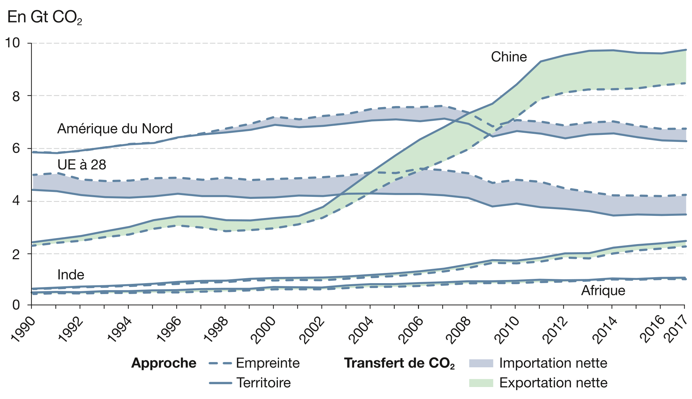
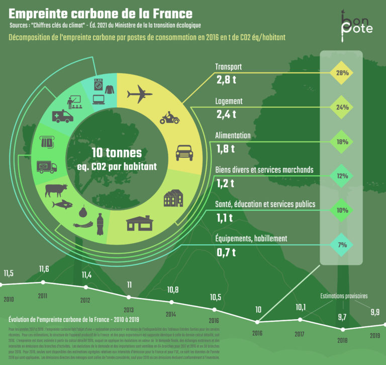
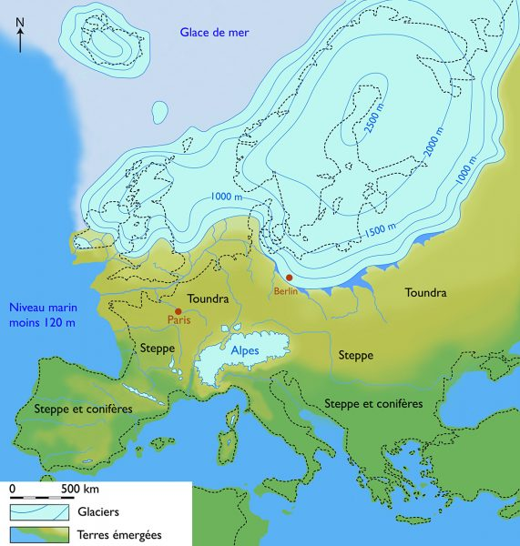
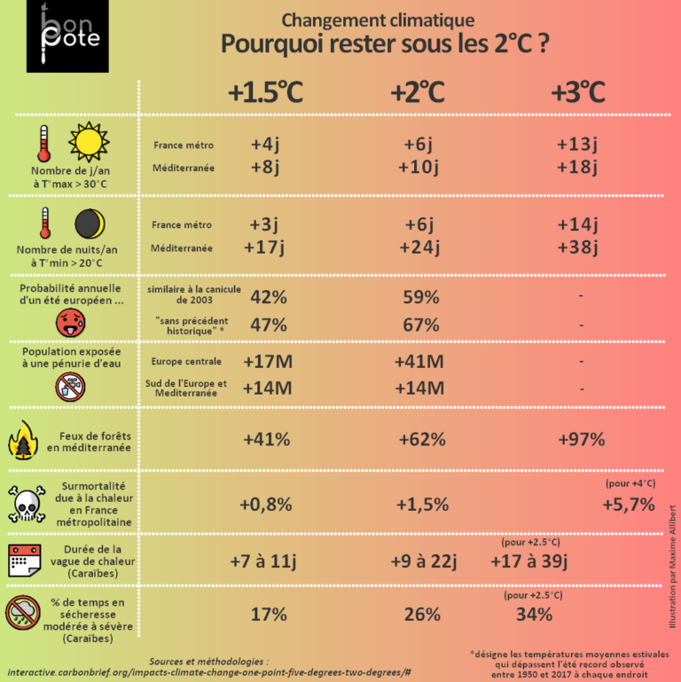
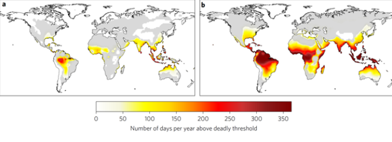
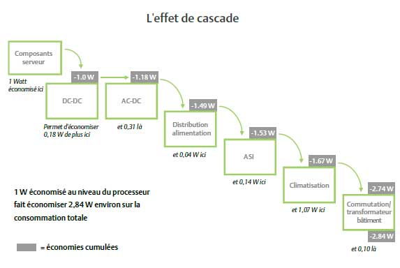
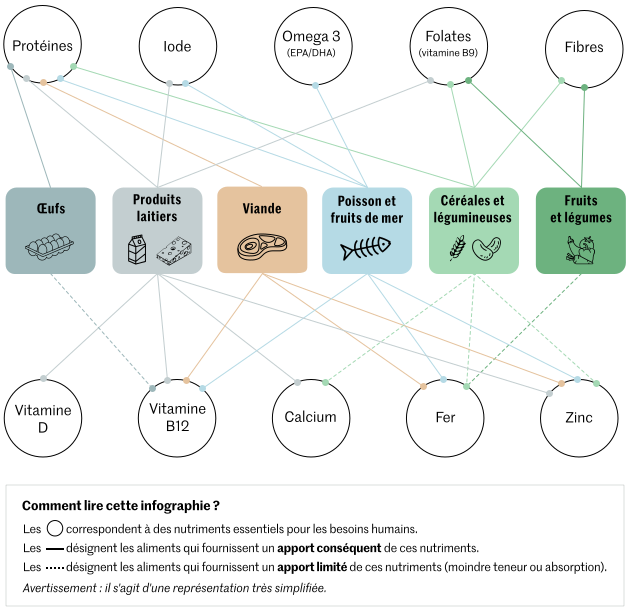

# Green IT : Les petits gestes

Ce document est un complément de la présentation [Green IT: les vrais petits gestes](https://prezi.com/view/qpvCT5y3PdddpkdkU7Z4).  
Si des erreurs ou des fautes sont présentes, n'hésitez pas à faire une PR.

- [Green IT : Les petits gestes](#green-it--les-petits-gestes)
  - [Les bonnes nouvelles](#les-bonnes-nouvelles)
    - [Introduction](#introduction)
    - [CO2 je te hais, mais comment s'en passer](#co2-je-te-hais-mais-comment-sen-passer)
    - [Chauffe Marcel](#chauffe-marcel)
    - [2050](#2050)
  - [Le green IT notre sauveur](#le-green-it-notre-sauveur)
    - [Les origines](#les-origines)
    - [En pratique](#en-pratique)
    - [Et l'humain](#et-lhumain)
  - [Vous](#vous)
    - [Se situer](#se-situer)
    - [Des bonnes intentions mais](#des-bonnes-intentions-mais)
  - [Comment réduire son empreinte individuelle ?](#comment-réduire-son-empreinte-individuelle-)
  - [Les premiers gestes](#les-premiers-gestes)
  - [Les gestes demandant un changement de mentalité](#les-gestes-demandant-un-changement-de-mentalité)
  - [Investir pour décarboner](#investir-pour-décarboner)
    - [Le logement](#le-logement)
    - [Les véhicules](#les-véhicules)
  - [La biodiversité](#la-biodiversité)
    - [Quelques chiffres](#quelques-chiffres)
    - [Dans mon jardin](#dans-mon-jardin)
    - [Dans ma maison et en vacances](#dans-ma-maison-et-en-vacances)
  - [Références](#références)
  
Licence : [CREATIVE COMMONS BY](LICENSE.txt "legal code")  

## Les bonnes nouvelles

### Introduction

*Dormez tranquille jusqu’en 2100* ce livre écrit par Jean-Marc Jancovici (je ne l'ai pas encore lu) est une bonne accroche pour commencer cette présentation.

On parle souvent de notre empreinte carbone, de la fin du monde, de la décroissance, des catastrophes naturelles. Certaines personnes, très souvent politisées, vont accuser le modèle néo-capitaliste occidental et vous faire passer pour des personnes ignorantes, non éclairées. Même si l'on ne peut nier que notre mode de vie est responsable de la plupart de notre impact environnemental, il ne faut pas tomber dans l'écueil du :

> "Ce n'est pas de ma faute ! Mais celle de la société !"
> ou bien "Je suis la cause de tous les désastres à venir."

Le monde n'est ni tout blanc, ni tout noir mais fait d'une multitude de nuances de gris.

### CO2 je te hais, mais comment s'en passer

Première bonne nouvelle:

- dans une Europe à 27 pays, La France se situe à la 11^ème place des pays les moins émetteur de CO2 ($1 tCO_{2eq}$)[1].

Si l'on se compare à nos voisins ayant un développement économique et industriel équivalent [1] :

- Nous émettons un peu plus de CO2 que l'Italie ($9,9 tCO_{2eq}$),
- Nous émettons beaucoup moins de CO2 que l'Allemagne ($14,6 tCO_{2eq}$),
- Nous émettons beaucoup plus de CO2 que l'Espagne ($8,8 tCO_{2eq}$).

Au niveau mondial, l'UE fait office d'exemple. Depuis 2008, que ce soit en production et importation nette de $CO_2$, les émissions ont baissé[2].

C'est une bonne nouvelle, mais en 2008 il se produit 2 événements :

1. La crise des Subprimes entraînant un fort ralentissement des investissements.
2. Le passage symbolique des 100 dollar US avec un record de 147 le 11/07/08 [3] sur le prix du baril conduit à une adaptation des comportements individuels et au début des politiques environnementales;
3. Le franchissement du pic d’extraction de pétrole conventionnel [4] selon l'IAE.

On peut affirmer que depuis 2008, l'UE subit une décroissance de ses émissions intérieures de CO2, sûrement due à la diminution des extractions de pétrole conventionnel. Il faut aussi noter que, selon le rapport de 2018 de l'IAE, le pic de production pétrolière est estimé à 2025 [4] et le consensus s'accorde sur une date comprise entre 2025 et 2030.  

> Note : Le pétrole dit conventionnel est le résultat de l'extraction directe par forage dans un réservoir de pétrole. Le pétrole dit non conventionnel couvre tous les autres types d'extraction (ex: pétrole de schiste et schiste bitumineux.)

Ainsi, que nous le décidions ou non, il faudra toujours faire avec moins de pétrole. En effet, le pétrole non-conventionnel ne s'exporte que très peu, tout comme le charbon.  

En zoomant sur la France et en s'intéressant sur la répartition de nos émissions de $CO_2$ on remarque :

- 10% de nos émissions sont hors de notre champ d'action[1]
- 90% restant se répartissent de la façon suivante[1] :
  1. Transport (31%).
  2. Logement (27%).
  3. Alimentation (20%).
  4. Bien et service (14%).
  5. Équipements et habillement (8%).

Deuxième bonne nouvelle:

- nous pourrions agir directement sur 90% de nos émissions de $CO_2$, ce qui est de bonne augure pour descendre à $2 tCO_{2eq}/hab$ comme la actée la COP de paris en 2015.

Cependant le cabinet de conseil Carbone 4 dans son rapport *Faire sa part ?* estime qu'un engagement dit 'héroïque', avec des investissements pour décarboner son mode vie, ne permet de diminuer que de 45% [5] l'empreinte carbone globale d'un français ou d'une française.

### Chauffe Marcel

> +5°C, la belle affaire ! On utilisera moins de pulls.

Avec la COP 26, qui a eu lieu en 2021, les pays ont redit leur volonté de limiter le réchauffement climatique à +2°C globaux pour 2100. Cependant les COP ne sont que des accords de principe sans aucune contrainte ou autorité de suivi.  

Mais finalement que signifie 2, 3 ou 5°C de plus ?

Première mauvaise nouvelle:

- notre corps est un très mauvais thermomètre. Il est difficile pour lui de percevoir une variation de quelques degrés. De plus, on parle de température moyenne sur une échelle de temps de 3 siècles ($XIX^{ème}$ - $XXI^{ème}$).  

Une élévation moyenne de la température terrestre de 5°C s'est produite entre -11 700 ans [6] et le $XIX^{ème}$ siecle. Au plus fort de la période glacière Würm, il était possible de se rendre en Grande-Bretagne à pieds comme le montre la carte ci-dessous :

Cette évolution sur plus d'une dizaine de milliers d'années a permis une augmentation du niveau de la mer de 120 m et le passage de paysages de Toundra et de Steppes en France aux paysages que nous connaissons actuellement.  

Si on suit la trajectoire actuelle, la même élévation de température se réalisera en l'espace de moins de 200 ans. Un tel réchauffement en un laps de temps aussi court aurait des conséquences difficilement imaginables. Si l'on regarde cette image, on voit que les conséquences de la hausse de la température sur les changements environnementaux ne sont pas proportionnelles. Ils sont exponentiels en fonction de la température. Bien qu'une augmentation de 5°C ait de lourdes conséquences, si l'on limite le réchauffement à 1,5 - 3°C, cela suffirait pour diminuer l'impact de celui-ci sur la Terre. 

Dans cette illustration, en se focalisant uniquement sur la France et en prenant une hausse de 1,5°C, nous avons :

- Presqu'une chance sur 2 d'avoir une température moyenne estivale supérieure aux records enregistrés entre 1950 et 2017;
- Plus de 2 semaines par an avec une température minimale la nuit supérieure à 20°C.

Tout degré de température supplémentaire implique un stockage de 20% de plus de vapeur d'eau dans l'atmosphère et celle-ci est le principal gaz à effet de serre. C'est à cause d'elle que les changements globaux augmentent de façon plus ou moins exponentielle avec la température. Sans la vapeur d'eau on estime que la température de la terre serait de -18°C [8]. Heureusement le cycle de l'eau la fera retomber sur Terre, mais sous forme de violentes pluies. De plus, le gradient de température entre le sol (troposphère) et l'atmosphère (stratosphère), va s'accentuer, créant ainsi des mouvements convectifs d'air, mouvements violents et plus importants (cyclone, tornade, typhon...).

Bonne nouvelle tout de même (enfin tout dépend où l'on se trouve), l'Europe devrait mieux s'en sortir que les pays proches de l'équateur. Là-bas, la température et le taux d'humidité extérieurs seront suffisants pour que quiconque ne se trouvant pas dans un environnement contrôlé, subisse la même mort que les personnes âgées lors de la canicule de 2003 [7].

La cartographie ci-dessus a été réalisée à partir des travaux du GIEC et publiée dans une revue scientifique à comité de lecture *Nature Climate Change*. La cartographie (a) se base sur un scénario de +1,5°C alors que l'autre sur un scénario de +5°C. Les morts surviendront par défaut de régulation thermique, autrement dit l'être humain n'aura plus la possibilité de réguler la température de son corps en en évacuant la chaleur.

### 2050

Si on reprend le titre du livre de JM.Jancovici il faudrait plutôt dire :

> Dormez tranquille jusque 2050.

C'est la dernière bonne nouvelle, quel que soit le scénario que l'on choisit. Réduire drastiquement les émissions ou continuer à vivre comme aujourd'hui, le climat de 2050 est déjà écrit et connu.  

Pourquoi cette certitude ? Simplement parce que le système de régulation climatique sur Terre possède une inertie. Si l'on veut bien comprendre le phénomène, lorsque l'on arrête d'alimenter les fourneaux d'une usine, ils continuent à chauffer jusqu'à ce que le liquide ou le gaz refroidisse. Plus les usines sont grosses, plus il y a une grosse quantité de liquide ou de gaz à faire refroidir, ce qui est plus long. Imaginez le temps qu'il faut pour notre bonne vieille Terre, qui est entourée de gaz ! De plus, quand on relâche une tonne de $CO_2$ dans l'atmosphère, 100 ans plus tard, il en reste encore au moins une demi-tonne [9].  

Vous ne verrez pas de votre vivant les effets de vos actions de réduction de l'émission de CO2. Mais les générations futures les verront. Il faut profiter de cette fenêtre de tir ou nous avons accès 'facilement' à l'énergie et vivons avec "peu" de contraintes climatiques pour amorcer la transition.

## Le green IT notre sauveur

### Les origines

- 1992 : Les Etats-Unis lancent le programme *Energy star* [10],
- 1998 : Tenue de la convention Aarthus qui définie le terme: information environnementale. Elle permet d'avoir accès a des données quantitatives et qualitatives sur l'environnement [10],
- 2003 : L'UE fixe les obligations des collectivités en matière de mise à disposition de l'information environnementale [10],
- 2004 : Fondation de la Fédération de la communauté francophone autour du GreenIT.fr [10],
- 2011 : Création de l'Alliance Green IT, association loi 1901 qui regroupe les acteurs français de l'informatique durable [10],
- 2012 : Publication de la première édition *Ecoconception web : les 115 bonnes pratiques* [10],
- 2015 : Appel à engagements pour la convergence entre les transitions écologique et numérique par le Conseil National du Numérique [10].

### En pratique

Le green IT ne se focalise pas uniquement sur la tech ou le code. Toute entreprise travaillant avec du matériel informatique peut appliquer des mesures du green IT [11].  

Pour une ESN ou une société disposant d'un serveur, il est possible d'estimer les émissions de $CO_2$ qu'il produit.  
Sachant que les serveurs actuels consomment une puissance de 170 W chacun [12] d'une part. En prenant une hypothèse de fonctionnement d'un serveur sur toute l'année, il consomme 1 489 kWh/an (170*365*24). D'autre part, 1 kWh d'électricité n'a pas la même empreinte carbone d'un pays à l'autre. En effet, ceux-ci ne produisent pas l'électricité de la même manière (pétrole, charbon, nucléaire, renouvelables... avec des parts différentes pour chaque moyen selon les pays).  
En multipliant la production de $CO_2$ (lors de la création d'électricité) selon les pays par la consommation en kWh de d'un serveur [13] on obtient:

1. Serveur français : $89,34 kgCO_{2eq}$.
2. Serveur canadien : $276,95 kgCO_{2eq}$.
3. Serveur chinois : $610,49 kgCO_{2eq}$.
4. Serveur des Royaumes-Unis : $680,47 kgCO_{2eq}$.
5. Serveur des Etats-Unis : $777,26 kgCO_{2eq}$.

Ainsi un serveur hébergé en France émettra presque 10 fois moins qu'un même serveur hébergé aux Etats-Unis. Il est donc intéressant dans un contexte de cloudification de choisir d'héberger ses applications sur des serveurs dont le mix énergétique est faiblement émetteur de $CO_2$.

Quid alors de résilience en cas d'incendie ou de catastrophes. Quid également du temps de latence.

1. La résilience :
   1. choisir une architecture en micro-service et stocker les micro-services sur des partitions distinctes,
   2. sauvegarder les données dans une autre zone,
   3. provisionner des VM de secours.
2. La latence :
   1. concevoir des API qui envoient peu de données,
   2. respecter les bonnes pratiques de l'écoconception,
   3. proposer une expérience utilisateur qui permet d'attendre quelques secondes.

En juin 2011,  **Le  livre vert : Datacenters  et  Développement  Durable  /  État  de  l'art  et  perspectives du Syntec  numérique**  indiquait  :  

> L'optimisation au  niveau serveur  permet  notamment  un  effet 'cascade'  ou  'boule de neige'.

En réduisant  les besoins  de  la couche  logicielle,  on  réduit  les besoins  en  équipements informatiques et  donc  des systèmes  d'alimentation  et  de  refroidissement. La  consommation  électrique  du  datacenter  baisse alors  mécaniquement  dans sa  globalité. Cet effet  cascade a  un  impact  en  phase  d’exploitation  (sur  la consommation  électrique)  mais également  en  phase  d’investissement.  En effet,  encore  trop  régulièrement,  la construction des  salles  serveurs  est  dimensionnée sur  la base de  puissance  théorique  issue  des  fiches  constructeurs [14]. 

### Et l'humain

On a tendance à s'imaginer le  sujet du Green-IT devant être traité par les développeurs et les responsables infra. Or, le Green-IT c'est avant tout des gestes que toute personne travaillant dans une société peut faire. Ils sont nombreux mais on va s'attarder sur 2 gestes sur lesquels seuls les collaborateurs ou collaboratrices peuvent agir directement :

- L'impression de documents :
  - une page imprimée (recto ou recto/verso) représente $10,22 gCO_{2eq}$ [15],
  - l'utilisation d'une ramette de papier recyclé émet $70 gCO_{2eq}$ de plus qu'une ramette issue d'arbre feuillus [16],
  - n'imprimer que ce qui est nécessaire.
- Le mode de transport domicile-travail pour un trajet de 10km [17] :
  - un trajet seul en voiture émet $198 gCO_{2eq}$,
  - un trajet en métro émet $25 gCO_{2eq}$,
  - un trajet en vélo à assistance électrique $20 gCO_{2eq}$ (si musculaire alors $0 gCO_{2eq}$).

En prenant l'exemple d'une ESN qui travaille sur le développement d'une application sur un sprint de 2 semaines et en prenant les hypothèses suivante :

- une personne de l'administration est nécessaire pour 40 personnes,
- l'équipe de développement se compose de 2 développeu·r·se·s,
- une personne du management est nécessaire pour 6 développeu·r·se·s,
- tout le monde vient en voiture.

En données d'entrée on prendra pour les véhicules :
| Modèle   | Consommation $l/100km$ [18] | Carburant | Émission $gCO_{2eq}/100km$ [19] | Émission carburant $gCO_{2eq}/l$ [20] |
|:---------|:---------------------------:|:----------|:-------------------------------:|:-------------------------------------:|
| fiesta   | 7,3                         | essence   | 99                              | 507                                   |
| 308      | 5,6                         | diesel    | 108                             | 543                                   |
| X3       | 9,4                         | essence   | 239                             | 507                                   |

> Note : Pour convertir des Giga Joules d'énergie en litre de carburant, la densité énergétique pour l'essence et le diesel est de $0,027 GJ/m^3$ [21].

- **Impact Dominique (admin)** :
  - 50 pages : $(50*10,22)/1000 = 0,51 kgCO_{2eq}$
  - Trajet A-R 62km en peugeot 308 : $62*((5,6*(0,543+0,108))/100) = 2,26 kgCO_{2eq}$
  - 10 jours sur site : $10*2,26 = 22,60 kgCO_{2eq}$
  - Total : $0,51+22,60 = 23,11 kgCO_{2eq}$

- **Impact Raphaël (dev)** :
  - 1 page : $10,22/1000 = 0,01 kgCO_{2eq}$
  - Trajet A-R 42km en ford fiesta : $42*((7,3*(0,507+0,099))/100) = 1,86 kgCO_{2eq}$
  - 8 jours sur site : $8*1,85 = 14,88 kgCO_{2eq}$
  - Total : $0,01+14,88 = 14,89 kgCO_{2eq}$

- **Impact Emmanuel (manager)** :
  - 5 pages : $(5*10,22)/1000 = 0,05 kgCO_{2eq}$
  - Trajet A-R 70km en BMW X3 : $70*((9,4*(0,507+0,239))/100) = 4,91 kgCO_{2eq}$
  - 8 jours sur site : $8*4,91 = 39,28 kgCO_{2eq}$
  - Total : $0,05+39,28 = 39,33 kgCO_{2eq}$

À l'issue d'un sprint de 2 semaines cette équipe aura généré à elle seule et en ne comptant que son transport et sa consommation de papier : $(3/40)*23,11+3*14,89+(3/6)*39,33 = 66,07 kgCO_{2eq}$ soit presque 3/4 des émissions de CO2 d'un serveur hébergé en France pendant 1 an.

## Vous

### Se situer

Sur internet, dans les médias ou autour de discussions, on peut trouver de nombreux conseils et des idées pour réduire son empreinte carbone. Mais bien souvent, il n'est pas évident de savoir l'impact réel de chacun des petits gestes ou même d'en avoir un ordre de grandeur.  Voici donc une liste non exhaustive avec des exemples pour se situer :

- **La température de son logement**, les normes des performances énergétiques des bâtiments (RT2005, RT2012 et RE2020), imposent comme hypothèse de calcul, une température moyenne annuelle du logement à 19°C[22]. Mais baisser son thermostat de 1°C représente une économie de 7% de sa consommation d'énergie [23].
- **La voiture**, les émissions varient beaucoup d'une énergie à une autre, d'une voiture à une autre, du pilote, etc. Mais on peut partir sur une moyenne de $99 gCO_{2eq}$[17] pour 5 km :
  - avoir un ou des passagers permet de répartir cette émission en parts égales,
  - un trajet à vélo à 15 km/h prend 20 min ($5/(15/60) = 20 min$) en supprimant les émissions,
  - un trajet à pied à 7 km/h prend 43 min ($5/(7/60) = 43 min$) en supprimant les émissions.
- **L'avion**, il a révolutionné le transport entre les continents et permet de faire un Lille-Marseille en 1 h 35 min. Cela dit, l'émission par passager est de $184,3 kgCO_{2eq}$[17]
  - un trajet en TGV prendra approximativement 3 fois plus de temps (5 h 08 min) en divisant d'un facteur 84 les émissions ($2,20kgCO_{2eq}$) selon la SNCF;
  - un trajet en voiture avec un passager prendra 6,5 fois plus de temps (9 h 45 min) en divisant par moins de 2 les émissions par rapport à l'avion ($96,60kgCO_{2eq}$)[17]
- **Les déchets**, ils génèrent également des gaz à effets de serres (GES) de par leurs transports. Pour les ordures ménagères il faut y ajouter le cycle de traitement (incinération ou enfouissement) soit $707,67 kgCO_{2eq}$ [24] :
  - en achetant un maximum en vrac et en compostant des déchets organiques, on réduit de 2/3 nos émissions [24],
  - en faisant ses produits ménagers et cosmétiques, en achetant des produits 100% ou majoritairement réutilisables les émissions sont divisés par 3 [24].
- **L'électroménager et numérique**, les étiquettes énergétiques changent régulièrement. Depuis mars 2021, les notes vont à nouveau de A à F avec des seuils relevés. Ainsi un appareil A+++ vendu avant 2021 peut être classé B ou C [25]. Puisque la production d'électricité est faiblement carbonée en France, les émissions de GES sont principalement dues à la production de ces appareils :
  - Pour un foyer de 3 personnes (2 adultes et un.e ado) l'électro-ménager, avant même d'avoir servi, a émis (en moyenne) $1,79 tCO_(2eqs)$ [cf](#Tableau-impact-fabriction). Il est donc préférable qu'il soit amorti dans le temps. Pour cela, il faut garder et réparer ses appareils le plus longtemps possible (Le Black Friday n'est vraiment pas votre ami).

- **Le régime alimentaire**, sûrement le geste avec le rapport investissement/réduction le plus élevé. La production de viande de bœuf est la plus émettrice de GES ($CH_{4}$ et $CO_{2}$). En effet, un bœuf demande beaucoup d'espace et de nourriture. Bien souvent, cette dernière est importée de très loin, faisant ainsi grimper l'empreinte carbone de la production de viande.
  - 1kg de viande rouge produit en moyenne $35,80 kgCO_{2eq}$,
  - 1kg de poisson blanc produit en moyenne $9,59 kgCO_{2eq}$,
  - 1kg de volaille produit en moyenne $5,16 kgCO_{2eq}$,  
  - 1kg de poisson gras produit en moyenne $4,03 kgCO_{2eq}$,
  - 1kg d'œuf produit en moyenne $2,61 kgCO_{2eq}$,
  - 1kg de tofu produit en moyenne $0,98 kgCO_{2eq}$.

#### Tableau impact fabriction

| Appareil                  | Émission ($kgCO_{2eq}$) | Quantité |
|:--------------------------|------------------------:|:--------:|
| Réfrigérateur-congélateur | 25,70                   | 1        |
| Lave-linge                | 34,20                   | 1        |
| Sèche-linge               | 26,60                   | 1        |
| Lave-vaisselle            | 27,10                   | 1        |
| Four                      | 18,08                   | 1        |
| Micro-onde                | 8,20                    | 1        |
| Plaques                   | 6,53                    | 1        |
| Bouilloire                | 1,65                    | 1        |
| Cafetière                 | 5,32                    | 1        |
| Aspirateur                | 6,55                    | 1        |
| Robot cuisine             | 41,30                   | 1        |
| Appareil photo            | 30,00                   | 1        |
| Ordinateur portable       | 156,00                  | 2        |
| Tour ordinateur           | 296,00                  | 1        |
| Écran ordinateur          | 248,00                  | 1        |
| Home cinéma               | 133,00                  | 1        |
| Nokia 3310                | 16,50                   | 0        |
| Smartphone                | 39,10                   | 2        |
| Iphone XI                 | 57,00                   | 3        |
| Tablette                  | 63,00                   | 1        |
| TV                        | 371,00                  | 1        |
| Vidéo Projecteur          | 94,00                   | 0        |

> Note : Niveau nutritionnel, seul un régime 100% végétalien (céréales, légumineuses, fruits et légumes) comporte des risques de carence en vitamine B12, zinc et fer. Pour les personnes anémiées en fer, il peut être dangereux de se passer de viande rouge car cet aliment contient beaucoup de fer facilement assimilable [26].

### Des bonnes intentions mais

- *Faire confiance aux labels 'verts'* requiert des connaissances précises sur les critères utilisés et sur le degré de contraintes imposées par l'autorité qui délivre ce label. Un label n'est jamais obligatoire, il est souvent utilisé dans un but commercial. Prenons l'exemple du label AB: Pour un produit alimentaire, il garantit qu'au moins 95% des ingrédients sont d'origine agricole biologique [27] et sont produits dans l'UE. Ainsi une tomate génétiquement sélectionnée pour sa résistance et poussant dans une serre chauffée au gaz en hiver en Espagne pourra apposer le label AB. Il peut être plus intéressant de réduire la chaîne d'approvisionnement en achetant au plus proche du producteur (en circuit court).
- *Domotiser son logement* semble être une bonne solution pour faire des économies d'énergie. Cependant, comme l'électricité en France est bas carbone, cette action a des conséquences très faibles sur l'émission des GES. Cette solution est même assez dommageable en certains points puisqu'il faut acheter un boîtier propriétaire afin d'utiliser les solutions constructeurs. Celui-ci doit rester en fonctionnement en permanence. Il faut ajouter à cela, l'achat de nouvelles ampoules ou autres appareils électroniques compatibles. La domotique est néanmoins intéressante pour piloter son chauffage à distance par exemple. Grâce à elle, il est aussi plus simple d'utiliser ses appareils lorsque les éventuels pics de consommation d'énergie sont passés.
- *Remplacer sa voiture par une hybride rechargeable ou un SUV/Cross-over ayant une étiquette supérieure ou égal à B* est intéressant uniquement si l'ancien véhicule a plus de 10 ans, ou plus de 210 000 km ou si son gabarit est supérieur ou égal à la nouvelle. En effet, les batteries ajoutent du poids au véhicule. Se déplacer demande alors plus d'énergie ($E_{c}=1/2mv$). Enfin, le coefficient de pénétration dans l'air d'un SUV/Cross Over est bien plus élevé qu'un break par exemple.
- *Passer du fioul au gaz pour le chauffage* apporte certes une réduction des GES, mais on remplace une énergie fossile par une autre qui n'est pas infinie. En fonction du budget et du type d'habitation, une chaudière à granulés, un poêle à bois, une pompe à chaleur ou des convecteurs électriques seront plus efficaces pour réduire les émissions de GES.
- *Changer toutes ses ampoules fluo-compactes par des LED* ne permet qu'une faible économie de consommation (1%) [5]. Il est préférable de remplacer les ampoules cassées ou les ampoules à filament ou encore les néons.

> Note : En France il y a de nombreux organismes qui s'occupent de la collecte et du recyclage de vos ampoules ou néons usagés.

- *Choisir un fournisseur d'électricité verte* ne garantit en aucun cas que l'électricité arrivant dans le logement n'a pas émis de carbone. En effet, l'électricité courante dans le réseau n'appartient encore à aucun fournisseur. Rien ne prouve que celle que j'utilise est celle que mon fournisseur paiera.

## Comment réduire son empreinte individuelle ?

Malheureusement, penser que réduire son impact sera facile, demandera ni sacrifice ni investissement, est un leurre. La publication *Faire sa part* [5] de carbone 4 est catégorique : sans investissements financiers mais en réalisant des changements radicaux de notre mode vie, on ne peut réduire que de 25% les émissions de GES. Ce taux descend à 10% pour des changements dits “réalistes”. Dans cette même publication, on peut constater que les actions maximales activables par les ménages sans investissements sont de :

- $1,3 tCO_{2eq}$ pour l'alimentation (régime végétarien, achat local, zéro déchet et gourde),
- $0,9 tCO_{2eq}$ pour la mobilité (vélo pour trajet de moins 10km, 100% covoiturage, ne plus prendre l'avion),
- $0,5 tCO_{2eq}$ pour les biens et services (trois fois moins de vêtements neufs, électronique et hi-tech d'occasion),
- $0,2 tCO_{2eq}$ pour le logement (baisser la température de consigne et équiper son logement d'éclairage LED).

Par rapport aux $10,8 tCO_{2eq}$ d'émission cela ne représente qu'une baisse de 27% en changeant considérablement son mode de vie.

En prenant ces propositions, ainsi que celle de l'ADEME et de l'association négaWatt [29], on peut arriver à répertorier les vrais gestes, actions et investissements à réaliser pour faire diminuer les émissions de GES.

> Note : le scénario négaWatt de 2022 suppose une sobriété accrue des ménages et des industries (diminution de notre consommation de pétrole dans notre quotidien qui est difficilement acceptable par la société). En outre, il pose des hypothèses sur les technologies récentes mais n'ayant pas été développé à l'échelle industrielle. Elle omet aussi le problème de concurrence d’utilisation des sols.

## Les premiers gestes

- Connaître son empreinte carbone actuelle sur [NosGestesClimat](https://nosgestesclimat.fr/ "NosGestesClimat") permet de faire un état de lieu de sa situation personnelle. Le site propose des actions et des défis à réaliser pour réduire son empreinte. Il est même possible d'apporter des améliorations avec un langage de programmation accessible.
- Installer des thermostats programmables par zone d'occupation permet un pilotage au plus proche des besoins d’un foyer. En effet l'occupation d'un bureau ou de chambres n'est pas la même que celle d'une cuisine, d'un salon ou d'une salle de bain.
- Covoiturer pour son trajet domicile-travail répartit entre les occupants le coût et les émissions engendrées par ce trajet. Ceci peut se cumuler également avec l'utilisation d'un vélo ou d'une trottinette électrique pour des trajets de moins de 5 km.
- Prendre une carte de réduction à la SNCF peut paraître anecdotique mais cela nous incite à envisager le train à la place de la voiture ou de l’avion.
- Éteindre ses appareils et ne pas laisser son ordinateur portable ou son smartphone sur le secteur permet d'éviter de gâcher de l'énergie. En l’absence de chargeurs dit "intelligents" capables de se couper automatiquement, l’utilisation de prises programmables est une solution pertinente.
- Les labels étant nombreux et non obligatoires, seule l'origine des produits peut devenir un critère objectif d’émission de GES. Choisir son produit en fonction de la proximité de son origine et non selon le prix, permet d'affirmer que nous sommes sur la bonne voie.
- "Les antibiotiques, c'est pas automatique !" On peut paraphraser ce slogan “Les viandes durant les repas, c’est pas systématique !”. La grande distribution a permis à une large majorité de français de manger de la viande au moins une fois par jour. Pourtant les éleveurs français ont subi une crise sans précédent. En allant vers des circuits courts on peut manger de la viande de meilleure qualité, peut-être moins souvent, mais cela vaut le coup si c'est pour redonner confiance à nos éleveurs.

## Les gestes demandant un changement de mentalité

- S'il est difficile, voire impossible, d'acheter de la viande en circuit court et s'il n'y a pas de contre indications médicales, il est envisageable de réserver la viande uniquement aux restaurant ou chez des amis. Évidemment on peut choisir cette option directement par conviction.
- Se fixer un objectif d'émissions de CO2 annuel est un bon moyen pour gérer sa mobilité. Cet objectif doit être atteignable et dépend de votre localisation. [Mon Impact Transport](https://monimpacttransport.fr/ "Mon Impact Transport") et/ou des calculs au réel en utilisant le [tableau données d'entrées des véhicule](#et-lhumain) ainsi que les émissions du véhicule (V.7 sur la carte grise), permettent de suivre vos émissions tout au long de l’année.
- Se passer des grandes surfaces serait l'idéal mais se limiter uniquement aux produits non alimentaires est déjà un grand pas. Attention toutefois aux achats en ligne et aux grossistes qui vendent des produits qui ne sont pas de saisons.
- Une bonne tartiflette c'est bon et c'est encore meilleur lorsqu'on l’a faite soi-même. Ce peut-être le cas aussi pour le pain, mais attention, il ne faut pas tomber dans l'écueil du 100% home made et acheter du matériel faisant grimper l'empreinte de l'équipement électro-ménager.
- La réutilisation est très bien pour diminuer l'empreinte carbone des biens et des services. Cependant certains objets du quotidien vont se heurter à notre acceptabilité. Si les couches, serviettes hygiéniques et culottes menstruelles lavables font leur chemin, sommes nous tous prêts à les utiliser. Pour certains, il y a u bloquage psychologique à ne pas négliger. De plus, certaines choses sont difficilement remplçables par du durable. En effet, pourrons-nous nous passer de papiers-toilettes, sommes nous prêt à nous essuyer les fesses avec du tissu et à passer notre temps à le laver ?
- Le sèche linge rend beaucoup de services, mais n'est pas nécessaire si un logement disposant d'un espace extérieur et intérieur pour faire sécher le linge existe, même si, parfois, les pulls mettent plusieurs jours à sécher. La même question peut se poser sur la télévision, à l’heure des portails de VOD, YouTube, Twitch, etc... Revendre sa télévision et acheter un projecteur émettant 4 fois moins de CO2 peut s'avérer être une bonne idée.
- En parler avec ses proches pour les sensibiliser est peut-être la chose la plus difficile car on se heurte à l'acceptabilité et aux certitudes des autres. Cela demande de la pédagogie et de l'empathie.

## Investir pour décarboner

### Le logement

Dès 2023 les logements de classe G ne pourront plus être loués. Même pour un logement classé D ou E, il est pertinent d'investir dans une rénovation thermique globale. Il y a cependant un ordre à respecter :

1. Isolation avec des matériaux biosourcés (Tout sauf laine de verre, laine de roche et polystyrènes) :
   1. Toiture,
   2. Murs donnant sur l'extérieur,
   3. Plancher bas,
   4. Huisserie.
2. Production de chaleur :
   1. Remplacer la chaudière gaz/fioul par une pompe à chaleur, un radiateur à inertie sèche ou une chaudière à bois,
   2. Remplacer le ballon d'eau chaude par un chauffe-eau solaire et électrique.
3. Autres logements :
   1. Faire comme la résidence principale,
   2. Éviter que le logement ne reste vacant pour rentabiliser l’investissement.

> Note : Le mix énergétique d'électricité étant bas carbone, l’installation de mini-centrales électriques ENR n'est, dans la plus part des cas, pas pertinente en France. Elle peut le devenir si l’électricité produite sert à recharger les batteries d’une voiture, d’un vélo, d’une trottinette électrique ou encore a alimenter en électricité un chauffe-eau.

### Les véhicules

Il convient de se poser la question de la réelle utilité d'une seconde voiture. Des solutions plus économiques existent : les vélos cargos à assistance électrique,les mini voitures comme la TWIZY ou l’Ami. La voiture principale doit être envisagée comme dernière solution pour un déplacement. Évidemment dans certains cas la seconde voiture est essentielle et aucune autre solution n'est envisageable.  
Concernant le véhicule principal, il faut éviter les formules location longue durée et voire la location avec option d'achat comme une obligation d'achat, pour ne pas changer toujours de voitures et éviter d'inciter à la production de nouvelles voitures. Tout comme les appareils électroniques une voiture à une empreinte non négligeable à la fabrication qu'il faut amortir. Les constructeurs dimensionnent leur véhicule pour 20 ans ou 250 000km. Si le véhicule à moins de 10 ans, il est urgent d'attendre avant de le changer, sauf si la famille s'agrandit et que le véhicule ne répond pas au besoin de mobilité.  
Lors du changement de véhicule, il faut privilégier une motorisation 100% électrique, mais il faut aussi choisir un modèle léger dont la pénétration dans l'air est optimisée. Dans le cas d'une motorisation partiellement ou entièrement thermique, il faut chercher à diminuer le poids et à augmenter l'aérodynamisme du véhicule. Le dernier point à prendre en compte sont les options qui doivent répondre à un critère d'utilité et de la configuration du véhicule.  
En résumé, il faut déconstruire l’image que l’on se fait de la voiture comme un marqueur social. Une voiture doit rester un mode de locomotion permettant de parcourir une longue distance infaisable à pied ou à vélo et dont les solutions de mobilité partagées (bus, métro, ter, rer, tgv, avion…) ne peuvent répondre aux besoins.

## La biodiversité

Si le réchauffement climatique est, à présent, relayé dans les médias et la presse, la perte de la biodiversité est rarement considérée comme un problème équivalent à celui des émissions de GES. Mais si l'on réduit effectivement les émissions de GES pour suivre les recommandations du GIEC, il reste encore le problème de la diminution de l’Indice de Planète Vivante (IPV) dont seules quelques personnes ont entendu parler. Pour bien se rendre compte des conséquences de la perte du vivant sur notre planète, il y a l’excellent atelier: la fresque de la biodiversité [30] dont il est recommandé d'y participer.

### Quelques chiffres

L'IPV est utilisé par de nombreux organismes gouvernementaux et inter-gouvernementaux. Il permet de suivre l'évolution du vivant sur Terre. Cependant, il se base majoritairement sur les vertébrés sur Terre, qui est le groupe le plus connu. Il calcule le taux de décroissance (ou croissance) des populations de toutes les espèces connues et en fait la moyenne. Depuis 1970, il a diminué de 68% au niveau mondial [31].  
La France a une réelle responsabilité vis-à-vis de la préservation de la biodiversité. En effet, 10% des espèces connues dans le monde, vivent, entre autres, en France (DROM-COM compris). On estime que 80% de la biodiversité vit en outre-mer. Mais pour l'instant, seules 85 238 espèces y sont connues contre  95 582 en métropole[32].  
Une particularité de la richesse en espèce d'une région, c'est qu'elle est d'autant plus forte qu'elle est proche des tropiques. A ce titre, 58% des espèces métropolitaines françaises sont présentes dans les Alpes-Maritimes [32]. Dans les Hauts-de-France, nous avons peu de diversité, il est d'autant plus important de la préserver.

Des chiffres en vrac [32] :

- 53 % des plantes liées aux insectes déclinent;
- 22 % de déclin moyen des 10 oiseaux granivores les plus communs;
- 9500 espèces et sous-espèces protégées sur le territoire Français selon l'INPN;
- 50% de la surface des zones humides en France a disparu entre 1960 et 1990 selon l'état des lieux des Zones Humides.

Les causes menaçant les espèces sont diverses et variées. Les plus importantes sont la destruction des habitats (notamment par l'urbanisation), la chasse (que ce soit par les chats ou par les humains), la pollution des eaux, l'arrivée d'espèces invasives, la présence de nombreux perturbateurs pour les espèces. Un bon exemple est l’éclairage urbain. La nuit, les espèces y sont exposées et cela perturbe leur cycle ou leurs repères en les assimilant à la lune. En effet, 85% du territoire est exposé à un niveau élevé de nuisance lumineuse [33]).

### Dans mon jardin

- Les plantes ornementales sont très prisées dans les jardins mais elles sont souvent exotiques. Elles ne comptent donc pas dans la biodiversité locale. De plus, elles peuvent parfois être envahissantes. Il existe de nombreuses espèces locales esthétiques dont l’entretien dans un jardin sera des plus facile. Le site du Conservatoire Botanique National de Bailleul [34] (CBNBL) pour les Hauts-de-France propose une grainothèque permettant de planter des espèces d'intérêt écologique et patrimonial.
- Les Espèces Exotiques Envahissantes (EEE) sont des espèces exotiques dont l’introduction par l’homme, volontaire ou fortuite, sur un territoire, menace les écosystèmes, les habitats naturels ou les espèces indigènes avec des conséquences écologiques, économiques et sanitaires négatives. Le danger de ces espèces est qu’elles accaparent une part trop importante des ressources dont les espèces indigènes ont besoin pour survivre, ou qu’elles se nourrissent directement des espèces indigènes [35]. Ces espèces doivent être éliminées entièrement car un simple rhizome restant peut leur permettre de repartir. Seules certaines décharges vertes sont habilitées à les détruire.
- Il est inutile de tondre toutes les deux semaines. Même si on trouve ça "moche", ceci découle de l'habitude de voir des pelouses tondues ras. Ne pas tondre trop souvent a pour avantage de laisser certaines plantes à cycle rapide faire des graines et des fleurs qui enrichiront le jardin. De plus, cela évitera aux autres espèces d'épuiser leurs ressources pour construire sans cesse de nouvelles feuilles.
- Les plantes n'ont pas besoin d'eau potable et cette eau est rare. L’eau de pluie ne coûte rien et les plantes ne verront pas la différence.
- La France est l'un des plus gros consommateurs d'engrais chimique en Europe. Par exemple, en 2018, 18 millions de tonnes de fertilisants minéraux et organiques ont été commercialisés en France métropolitaine dont 11,5 millions de tonnes d’origine minérale, selon l’Observatoire pour la fertilisation minérale et organique. Les engrais minéraux (chimiques) qui se déversent ensuite dans les cours d'eau, lors du ruissellement des pluies, perturbent la biodiversité ripicole.
- Le compost est un fertilisant naturel. Pourquoi acheter des intrants chimiques et jeter les feuilles qui sont un intrant naturel lorsqu'elles se décomposent? De plus, elles amèneront une faune du sol variée et nombreuse, travaillant à leur transformation en humus.
- Les insectes sont nécessaires à la pollinisation mais ils sont aussi à la base de nombreuses chaînes alimentaires. Ils ne se réduisent pas uniquement aux abeilles domestiques. Il est possible d'en favoriser de nombreux autres. Construire un hôtel à insectes est une activité ludique pour les enfants et elle les sensibilise à la protection de la nature.
- L'hiver, de nombreux oiseaux ne migrent pas. Auparavant, ils pouvaient trouver assez facilement de la nourriture mais aujourd'hui, les espaces non construits se font rares et les populations d'espèces compétitives comme le pigeon, grandissent. Faire de petits nichoirs permet de favoriser les Mésanges, les Gros-bec, les Moineaux et d'autres passereaux.
- Lorsque l'on cultive toujours au même endroit, le sol s'appauvrit au fur et à mesure. Bouger la serre permet de limiter l'utilisation d'intrants et de laisser le temps au sol de se recharger en matière organique se décomposant pour recréer de l'humus. Cet humus contient de la nourriture pour les plantes. Cela implique de ne pas laisser le sol sans végétation (les mauvaises herbes feront très bien l'affaire...)

### Dans ma maison et en vacances

- Lorsque l'on construit une nouvelle maison passive, on agit pour la diminution des émissions de GES. Mais qu'en est-il des habitats naturels dont la surface diminue de plus en plus à cause de l'urbanisation? Cela entraîne immanquablement la diminution des populations d'espèces vivant dans ces habitats.
- Apprendre à connaître la faune et la flore permet d'apprendre à prendre soin d'elle. Les scientifiques ont toujours besoin de données actualisées pour suivre l'évolution de la biodiversité. Ce peut être signaler la présence de hérissons, chauves-souris, écureuils dans son jardin auprès d'associations locales par exemple.
- Les chauves-souris en France sont en déclin. Elles subissent l'assaut des lumières persistantes pendant la nuit. Elles peuvent parfois s'épuiser de nombreuses heures autour d'un lampadaire, cela menant à leur mort. En outre, elles sont méconnues et mal-aimées car des légendes les présentaient autrefois comme des créatures de l'ombre. Laisser les combles accessibles aux chauves-souris participe à leur sauvegarde. Elles pourront venir y hiverner. Dans tous les cas, tuer une de ces petites bêtes est interdit et répréhensible car elles sont protégées.
- Les plantes et animaux exotiques peuvent devenir exotiques envahissants si les conditions climatiques leurs sont favorables. Par ailleurs, certaines peuvent aussi représenter un risque pour la santé publique.
- La Terre n'est pas une poubelle. Les déchets sont très nombreux partout. Ils ont de nombreuses incidences sur la vie des espèces. On connaît très bien, notamment par les médias, les problèmes que subissent les poissons avec les plastiques dans les océans. C'est aussi le cas dans les rivières, ou pour les oiseaux. Ajoutons à cela que les papiers contiennent parfois des encres qui peuvent être des produits toxiques pour les espèces. Les produits dans les mégots de cigarette sont toujours toxiques quant-à-eux... Les bouteilles sont des pièges pour de nombreux gastéropodes et pour la faune du sol. Chaque déchet jeté peut tuer plusieurs dizaines d'êtres vivants. Malheureusement, il y en a tellement que tous les ramasser semble une épreuve sans fin.
- Le piétinement est une source de stress pour les plantes. Plus un espace est piétiné, moins il sera riche en espèces car il ne restera que les plus résistantes. Les animaux qui ont besoin de diversité sont liés aux habitats non piétinés. Pour éviter de trop impacter le vivant, autant limiter ce phénomène en se contentant de suivre le chemin.
- Parfois une fleur peut être très belle, tellement que l'on voudrait la cueillir et la ramener chez soi. Pas de chance c’est une plante protégée! Leur destruction (et donc leur cueillette) est interdite et donc répréhensible. Pour permettre à ces espèces de se reproduire (pour ne pas disparaître), il faut les laisser accomplir leur cycle de reproduction complet (feuilles-fleurs-fruits-graines).
- Certains médicaments contiennent des régulateurs hormonaux ou des substances toxiques pour les poissons. Après s'être retrouvées dans vos toilettes, ces substances sont emmenées dans les stations d'épuration. Mais, pour la plupart, les traitements qu'elles subissent ne les empêchent pas de se retrouver dans les rivières.
- Privilégier la pêche durable est un moyen de garantir la reproduction suffisante des poissons en incitant les pêcheurs à respecter des taux de pêches plus faibles. Si une espèce se reproduit moins vite qu'elle n'est prédatée, elle disparaît.

## Références

[1]: <https://bonpote.com/les-infographies-bon-pote/> "Bon Pote infographies"
[2]: <https://www.statistiques.developpement-durable.gouv.fr/edition-numerique/chiffres-cles-du-climat/5-empreinte-carbone-et-emissions-territoriales> "Empreinte carbone et emissions territoriales"
[3]: <https://prixdubaril.com/comprendre-petrole-cours-industrie/68508-grandes-hausses-baisses-prix-petrole-1990-2020.html#:~:text=En%20janvier%202008%2C%20le%20baril,2008%2C%20d%C3%A9passant%20les%20147%20dollars.> "Record prix baril"
[4]: <https://www.lemonde.fr/blog/petrole/2019/02/04/pic-petrolier-probable-dici-a-2025-selon-lagence-internationale-de-lenergie/> "Pic pétrolier"
[5]: <https://www.carbone4.com/publication-faire-sa-part> "Faire sa part"
[6]: <https://fr.wikipedia.org/wiki/Glaciation_de_W%C3%BCrm> "Glaciation de Würm"
[7]: <https://www.lemonde.fr/climat/article/2017/06/19/mourir-de-chaud-un-risque-pour-30-de-la-population-mondiale_5147554_1652612.html> "Mourir de chaud"
[8]: <https://www.futura-sciences.com/planete/questions-reponses/rechauffement-climatique-vapeur-eau-elle-gaz-effet-serre-912/> "Eau principal GES"
[9]: <https://jancovici.com/changement-climatique/gaz-a-effet-de-serre-et-cycle-du-carbone/quels-sont-les-gaz-a-effet-de-serre-quels-sont-leurs-contribution-a-leffet-de-serre/> "Les GES"
[10]: <https://fr.wikipedia.org/wiki/Informatique_durable#Historique> "Historique Green IT"
[11]: <https://club.greenit.fr/doc/2017-12-ClubGreenIT-RefGIT-checklist.v2.pdf> "Check-list Green IT"
[12]: <https://normandie.ademe.fr/sites/default/files/chiffres-cles-consommation-energetique-equipements-informatiques.pdf> "Chiffre clé green-it"
[13]: <https://www.bilans-ges.ademe.fr/documentation/UPLOAD_DOC_FR/index.htm?moyenne_par_pays.htm> "Emission $CO_2$ mix électrique pays"
[14]: <https://www.ademe.fr/sites/default/files/assets/documents/guide-lecture-livre-blanc-consommation-energetique-2015.pdf> "Guide de lecture du Livre Blanc"
[15]: <https://sites.google.com/site/pasdepapier/home/l-empreinte-carbone> "Empreinte carbone papier"
[16]: <https://www.bilans-ges.ademe.fr/documentation/UPLOAD_DOC_FR/index.htm?papier__carton_et_articles_en_.htm> "Recyclage du papier"
[17]: <https://monimpacttransport.fr/> "Mon impact transport"
[18]: <https://fr.mappy.com/itineraire#/option_de_deplacement> "Option de déplacement mappy"
[19]: <https://www.lacentrale.fr/fiche-technique-auto.php> "Fiche auto la centrale"
[20]: <https://www.bilans-ges.ademe.fr/documentation/UPLOAD_DOC_FR/index.htm?new_liquides.htm> "Émission directe carburant liquide"
[21]: <https://www.convertir-unites.info/convertir+GJ+en+m3+Essence.php> "Convertir GJ en l essence"
[22]: <http://www.planbatimentdurable.fr/comprendre-la-rt-2012-r174.html> "Comprendre la RT2012"
[23]: <https://librairie.ademe.fr/changement-climatique-et-energie/998-40-trucs-et-astuces-pour-economiser-l-eau-et-l-energie-9791029712784.html#/44-type_de_produit-format_electronique> "40 Trucs et astuces de l'ADEME"
[24]: <https://nosgestesclimat.fr/documentation> "Nos gest climat documentation"
[25]: <https://fr.label2020.eu/la-nouvelle-etiquette-energie/caracteristiques-principales-des-nouvelles-etiquettes-energie/> "La nouvelle étiquette énergétique"
[26]: <https://www.lemonde.fr/les-decodeurs/article/2021/02/27/non-il-n-est-pas-necessaire-de-manger-de-la-viande-pour-etre-en-bonne-sante_6071378_4355770.html> "Peut on se passer de viande ?"
[27]: <https://www.agencebio.org/wp-content/uploads/2018/10/regles_usage_marque_AB.pdf> "Règle d'usage marque AB"
[28]: <https://youtu.be/goceQuwWwKA> "Video: Les dessous de l'électricité verte"
[29]: <https://negawatt.org/IMG/pdf/synthese-scenario-negawatt-2022.pdf> "Synthèse scénario négaWatt 2022"
[30]: <https://www.fresquedelabiodiversite.org/> "La fresque de la biodiversité"
[31]: <https://www.wwf.fr/rapport-planete-vivante> "Rapport Planète Vivante 2020"
[32]: <https://inpn.mnhn.fr/docs/communication/livretInpn/LIVRET_INPN_2019.pdf> "La biodiversité en France: 100 chiffres expliqués sur les espèces"
[33]: <https://ofb.gouv.fr/actualites/un-nouvel-indicateur-pour-mesurer-la-pollution-lumineuse#:~:text=Le%20nouvel%20indicateur%20de%20l,niveau%20%C3%A9lev%C3%A9%20de%20pollution%20lumineuse.> "Un nouvel indicateur pour mesurer la pollution lumineuse"
[34]: <https://www.cbnbl.org/grainotheque> "Grainothèque"
[35]: <https://www.ecologie.gouv.fr/especes-exotiques-envahissantes> "Espèces Exotiques Envahissantes"
